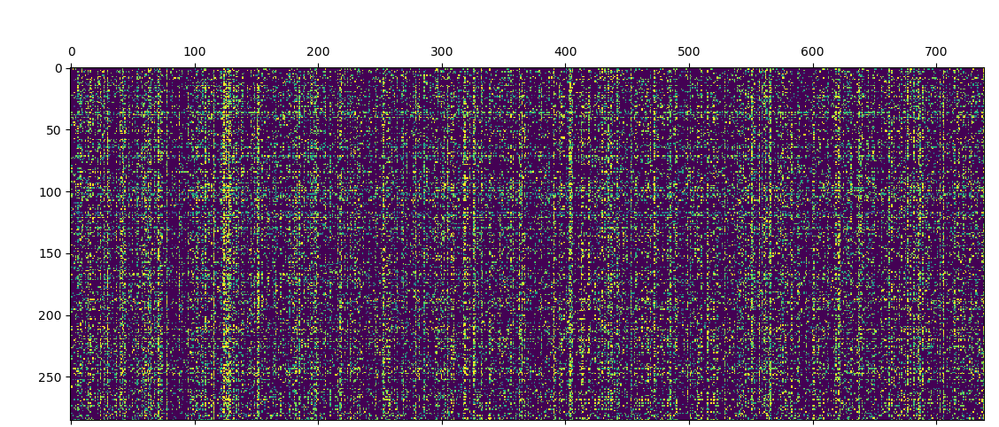
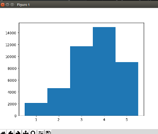
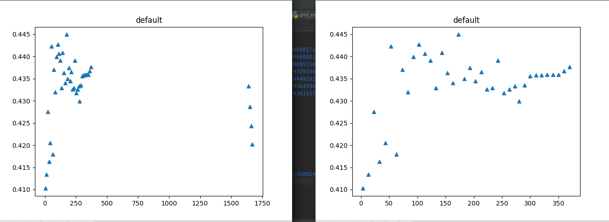
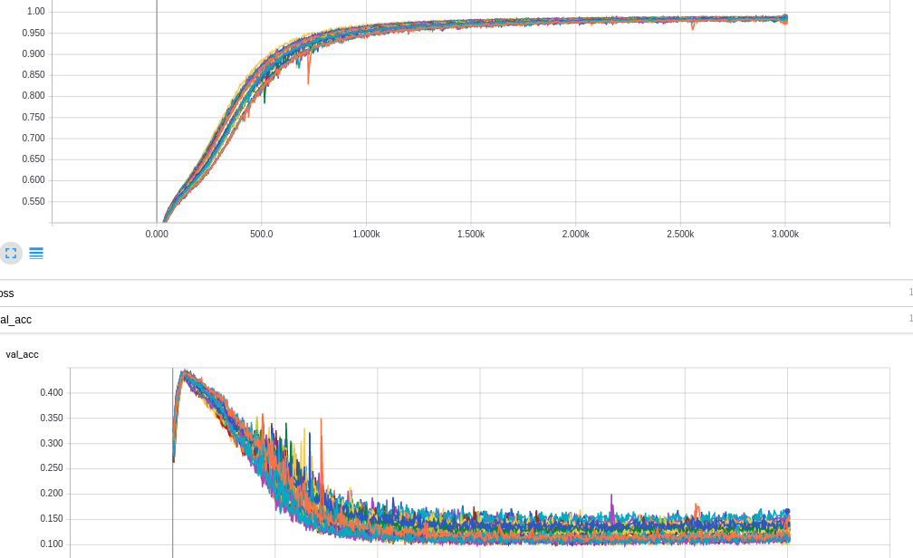
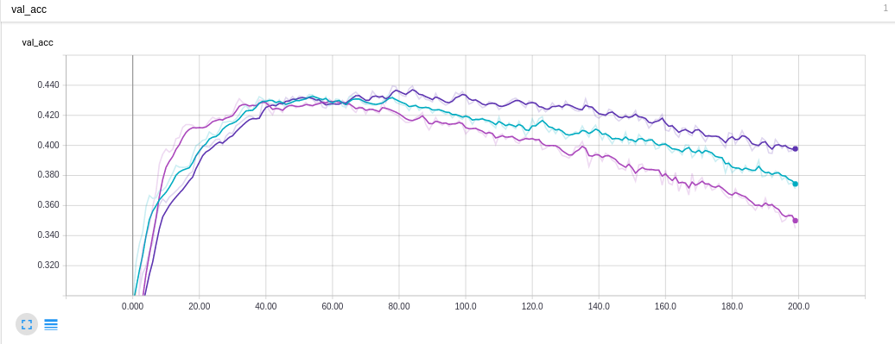
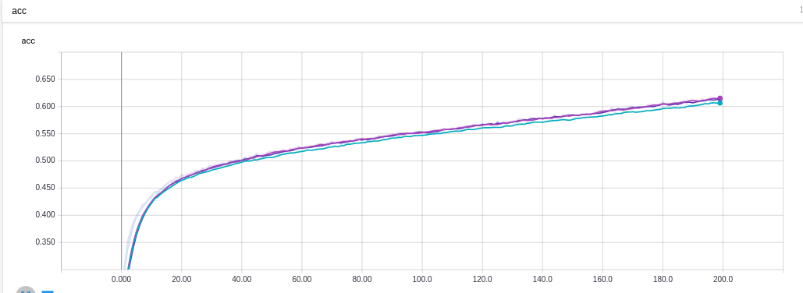
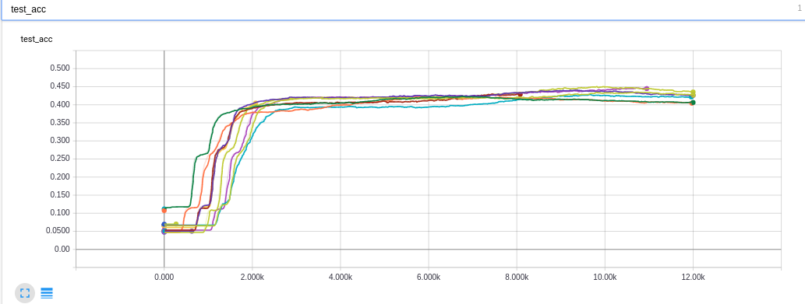
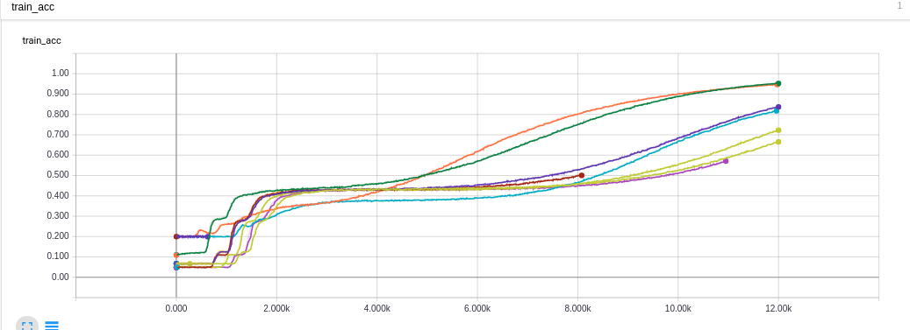

# Collaborative Filter

## Dependence
- Python 2.7
    - Tensorflow 1.1 
    - Keras 2

## Run

- `predict_sub_txt.txt` is the final results I predicted


- Put `train_sub_txt.txt` in `data\`
- Run `ensemble.py`, generate `res.txt` in root directory
### Project Structure
```
$ROOT
├── clean.sh
├── data
│   └── train_sub_txt.txt
├── README.md
└── src
    ├── config.py
    ├── data.py
    ├── ensemble.py
    ├── grid_search.py
    ├── logger.py
    ├── model.py
    └── utils.py
```
## Method 
- DeepCF re-implemented  with reference to [2] and there are  following modifications for our problem:
  - Turn it into classification problem rather than regression.
  - EarlyStop to avoid over fitting, rather than eject noise.
  - Others:  Model Ensemble.
- Inherited Ideas:
  - Use history ratings as item's raw feature, enable to  generalize better to unseen items. with at least 10 ratings.  Because the input is raw feature rather than user index.
  - Adapt In-Matrix prediction, split train: test= 9:1, no overlapping between train and test data.
  - Others: Shuffle and Clean Data, Grid Search.
### Some Visualizations:
- After Remove Item less than 10.7 ratings, and shuffle User/Item index:
- - 
- Data Distribution is not balanced, so I tried to augment the unbalanced data, but in the future work I may use on-line hard example mining instead. 
- - 
- After grid search for latent dim of SVD, I choose 100
- - 
- From grid search result for Deep CF, we can see severe over-fitting phenomenon
- - 
- So I have to apply early-stop, and I find although the accuracy of DeepCF(On Test Set)  is just slightly higher than SVD. But after ensemble, final accuracy can higher than both.
- - 
- - 
- The train and test pattern of SVD, not severely  suffer from over-fitting
- - 
- - 

## TODO list
- [ ] On-line Hard Example Mining
- [x] Ensemble SVD and DaulNet 
- [x] Whether to Early-stop/ Checkpoint
- [x] Whether to balance training dataset (Aug+Shuffle)
- [x] SVD 
    - Grid search 
        - latent dim / Dropout / regularize hyper-parameter 
    - accuracy on the fly
- [x] DaulNet
    - Grid search
    - Last time result
    
|      | name               | acc      |
| ---- | ------------------ | -------- |
| 0    | svd_ynobsxylrc     | 0.438849 |
| 1    | svd_mtmhmysqcu     | 0.436098 |
| 2    | svd_lmtulnapux     | 0.435675 |
| 3    | svd_faufhruaaq     | 0.434405 |
| 4    | svd_uxvjuhhcnk     | 0.432234 |
| 5    | deep_cf_cfrjuudupl | 0.443504 |
| 6    | deep_cf_kjjiarcqqq | 0.444774 |
| 7    | deep_cf_iwmyylneww | 0.448159 |
| 8    | deep_cf_imdhxyutfe | 0.448295 |


# Reference
- [1] `SVD` : https://github.com/mesuvash/TFMF/blob/master/TFMF.ipynb 
- [2] `DaulNet`/`DeepCF` re-implement from Xiong Y, Lin D, Niu H, et al. Collaborative Deep Embedding via Dual Networks[J]. 2016. (With Some Modifications)